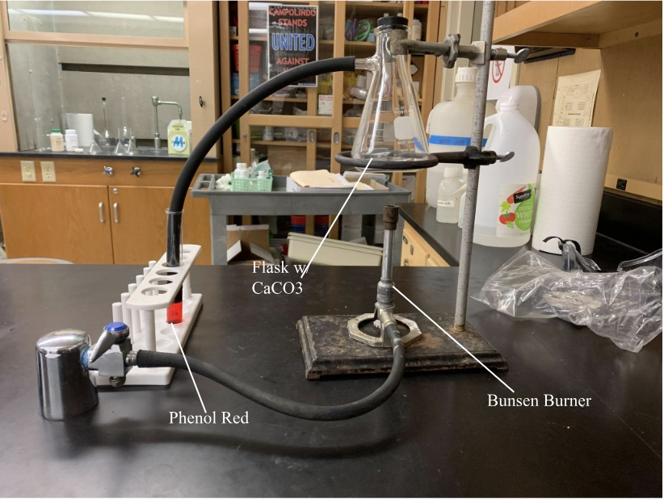

# Milan Stoyanov
## New Website Started

> This is a block quote
>
>> What am I going to use this for?

So, now I can write paragraphs. I have to write a lot of paragraphs, all the time, and I'm just wondering how this will work. I am going to break   
the paragraph. Now I'm going to do it  
more **elegantly**. More *elegantly*. More ***elegantly***. 

can I use HTML? Yes, I think so.

