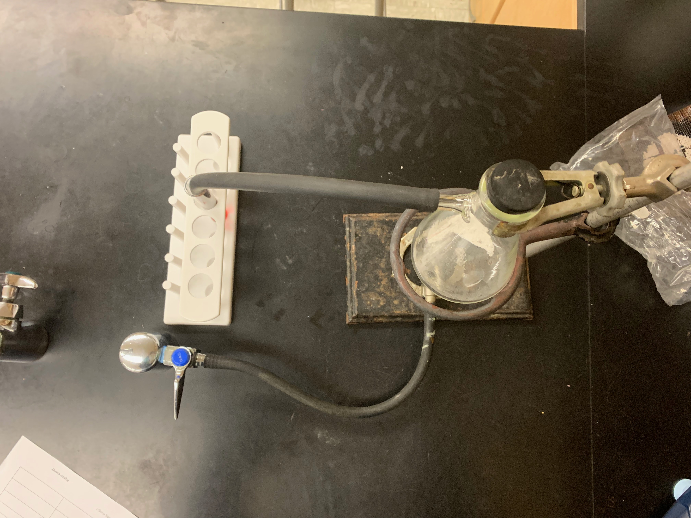
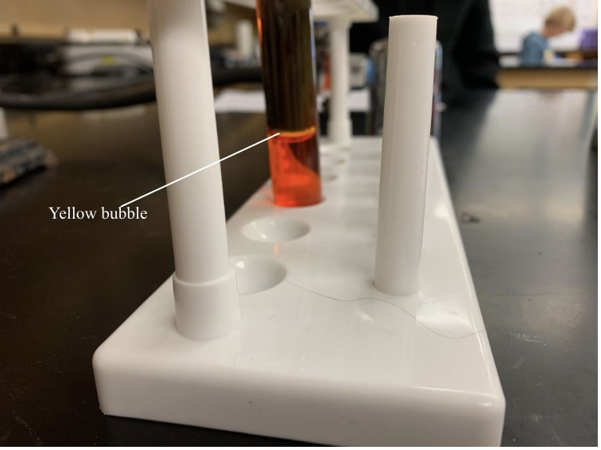
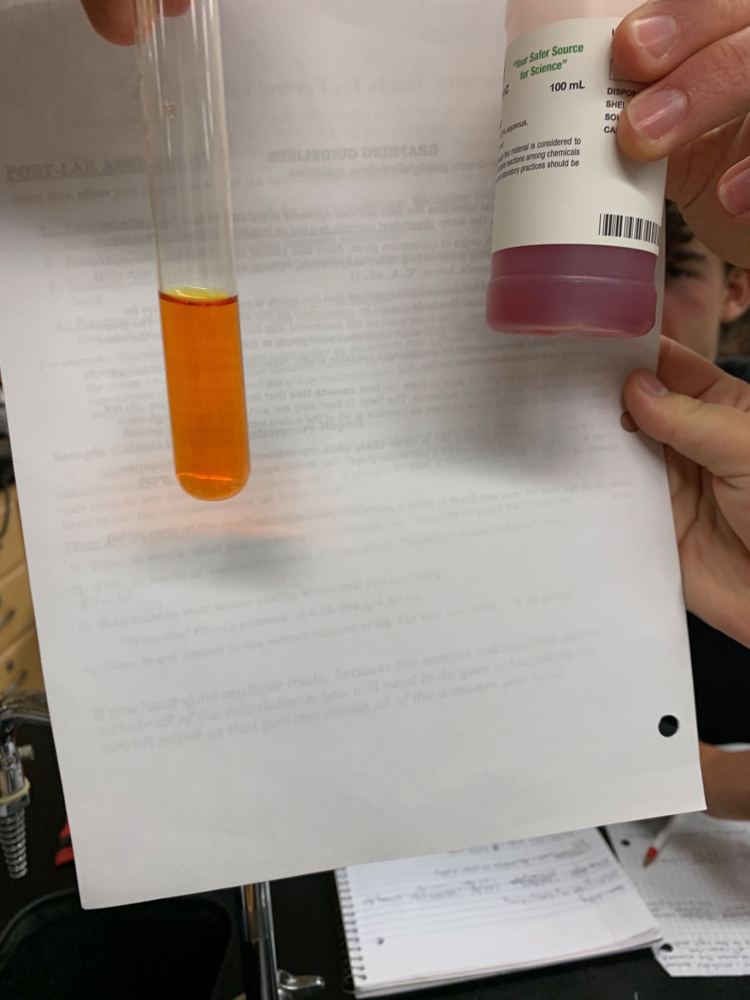

# Direct Air Capture

## Climate Technology and My Adaptation

##### By: Milan Stoyanov

### Direct Air Capture is the process of capturing carbon dioxide directly from the atmosphere through exposure to a solid sorbent, which allows atmospheric CO₂ to be directly absorbed. One of these various methods, which I chose to learn more about and test in the lab myself, involves limestone, or calcium carbonate (CaCO₃).

#### Heirloom's Process

[Heirloom Carbon Technologies](https://www.heirloomcarbon.com/)  is a company that uses limestone for CO₂ removal. First, the limestone (CaCO₃) is heated to about 900°C in a reactor powered by renewable energy. This results in the following decomposition reaction caused by the desorption of CO₂ at this temperature:  

>CaCO₃ → CaO + CO₂  

The products are CaO, or calcium oxide, and CO₂, or carbon dioxide. The CO₂ is then taken through a process known as carbon storage, where it is compressed and transferred through pipes into underground rock formations, resulting in safe storage. Heirloom then takes the CaO and, in a process known as hydration, combines it with water to form Ca(OH)₂, or calcium hydroxide: 

>CaO + H₂O → Ca(OH)₂  

This process is also exothermic, allowing for energy recovery. Next, the Ca(OH)₂ is spread on trays and stacked to provide maximum reaction area while minimizing land requirements. The calcium hydroxide then reacts with ambient CO₂ in a step known as carbonation to reform calcium carbonate and capture the CO₂ in the air back into new limestone:  

>Ca(OH)₂ + CO₂ → CaCO₃ + H₂O  

The new calcium carbonate (CaCO₃) is then used again in the process. This cyclical nature of the process allows for efficient use of resources and limited costs of reactants.

 

#### My Project

I was immediately interested in Heirloom’s DAC process, but I could not replicate the industrial scale, renewable energy sources, or carbon storage process. Therefore, I decided to showcase the science behind the process, instead using an indicator to show when I had desorbed carbon dioxide from the calcium carbonate.
* First, I acquired limestone from my chemistry teacher, and then used a mortar and pestle to crush it into a powder.
  >CaCO₃ is ionically bonded and therefore brittle, as striking it shifts the ions that are in an alternating positive and negative lattice structure and causes repulsion, breaking the bonds.

* Next, I placed 2g of CaCO₃ into a sidearm flask and evacuated the air with a syringe, as the heat would increase the pressure and I didn’t need the ambient air inside the flask. 
* Then, I attached the flask above a bunsen burner and attached a hose to the bunsen burner which would flow into a test tube containing phenol red, an indicator. When phenol red comes into contact with CO₂, it lightens to an orange-yellow color.

<figure>
     
    <figcaption>Initial experimental design before heat. Note color of phenol red.</figcaption>
</figure>

<figure>
     
</figure>

As I heat the calcium carbonate, it decomposes in the following reaction:  

>CaCO₃ → CaO + CO₂ 

When this carbon dioxide flows through the hose and comes into contact with the phenol red indicator, they react and produce carbonic acid, which makes the solution more acidic and therefore lowers the pH, lightening the solution to an orangish color.

<figure>
     
    <figcaption>See yellow bubble caused by flow of CO₂ gas in above figure. </figcaption>
</figure>

<figure>
     
    <figcaption>Comparison of original phenol red color to post-CO₂. </figcaption>
</figure>
 
This is proof of the separation of CaO and CO₂ which is important for the next step of the reaction to commence. CaO is then used as a carbon sorbent, allowing the carbon dioxide in the atmosphere to react with the CaO and reform CaCO₃:  

>CaO + CO₂  → CaCO₃  

Heirloom uses controlled carbonation to accelerate the rate of carbonation, or the above reaction, to about 3 days. However, seeing as I do not have access to this, I left the beaker with CaO in my chem lab over the holiday break, which is about enough time for the natural 2-week period of carbonation to occur. 

#### Works Cited

Works Cited
McQueen, Noah, et al. A scalable direct air capture process based on accelerated weathering of calcium hydroxide. 29 Mar. 2022. Heirloom Carbon Technologies, uploads-ssl.webflow.com/639c8f646dc35afd81aeebc2/63c563a258baba2baf4813d9_Heirloom_Perspective-Article.pdf. Accessed 3 Jan. 2024.  
"What is carbon capture and storage?" nationalgrid, www.nationalgrid.com/stories/energy-explained/what-is-ccs-how-does-it-work. Accessed 3 Jan. 2024.

